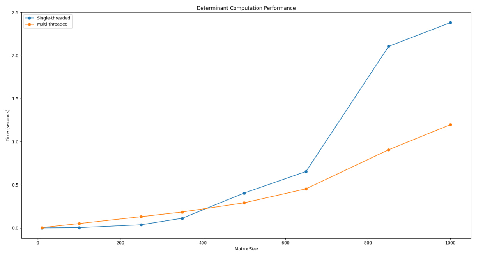

# Matrix Determinant Calculator

This project implements the calculation of the determinant of an \(N \times N\) matrix using Gaussian Elimination Method (GEM). The implementation includes both single-threaded and multi-threaded versions to compare their performance.

## Table of Contents
- [Overview](#overview)
- [Features](#features)
- [Project Structure](#project-structure)
- [Build Instructions](#build-instructions)
- [Usage](#usage)
- [Performance Test Results](#performance-test-results)
- [Performance Test Table](#performance-test-table)
- [Testing](#testing)
- [Evaluation Checklist](#evaluation-checklist)
- [How It Works](#how-it-works)
- [Notes](#notes)
- [Conclusion](#conclusion)

## Overview
This program computes the determinant of a matrix using both single-threaded and multi-threaded Gaussian elimination. It can handle matrices of size up to \(1000 \times 1000\) and reads matrix data from a text file.

## Features
- **Single-threaded mode (`--single`)**: Computes the determinant using a single thread.
- **Multi-threaded mode (`--multi`)**: Distributes computation across multiple threads to improve performance.
- Handles input matrices of size from 1x1 to 1000x1000.
- Outputs execution time and handles singular matrix detection.

## Project Structure
```
├── data/                # Matrixes that were tested
│   ├── ...
│   ├── ...
│   .....
│   └── ...
├── src/
│   ├── main.cpp         # Main application
│   ├── matrix.cpp       # Implementation of matrix operations
│   └── matrix.hpp       # Declarations of matrix functions
├── tests/
│   ├── tests.cpp        # Contains test cases
│   ├── tests-main.cpp   # Defines CATCH_CONFIG_MAIN for test entry point
│   ├── catch.hpp        # Catch2 header for unit testing
├── CMakeLists.txt       # CMake build configuration
└── README.md            # Project readme
```

## Build Instructions
### Prerequisites
- C++ compiler (supporting C++17 or newer)
- `CMake` (version 3.15 or newer)

### Steps
1. Clone the repository:
   ```bash
   git clone <your-repo-url>
   cd <your-project-directory>
   ```
2. Create and navigate to the `build` directory:
   ```bash
   mkdir build && cd build
   ```
3. Run `cmake` to generate the build files:
   ```bash
   cmake -G "Mingw makefiles" ..
   ```
4. Compile the code:
   ```bash
   mingw32-make
   ```

## Usage
After building, you will have the following executable:

```bash
./MatrixDeterminant [--single | --multi] <matrix_file>
```

### Options
- `--single`: Runs the single-threaded version of the determinant calculation.
- `--multi`: Runs the multi-threaded version using available CPU cores.
- `--help`: Prints usage information.

### Example
```bash
./MatrixDeterminant --single ../data/matrix_100x100.txt
./MatrixDeterminant --multi ../data/matrix.txt
```

### Matrix File Format
- The first line contains the size `N` of the matrix.
- The following `N` lines each contain `N` space-separated numbers representing the matrix rows.

**Example matrix file (`matrix.txt`):**
```
3
6 1 1
4 -2 5
2 8 7
```

## Performance Test Results
The following performance results were obtained for various matrix sizes:

## Performance Test Table

| Matrix Size | Single-thread Time (seconds) | Multi-thread Time (seconds) |
|--------------|-----------------------------|-----------------------------|
| 10x10        | 0.0000146                    | 0.0030483                    |
| 100x100      | 0.0027983                    | 0.0504215                    |
| 250x250      | 0.0363095                    | 0.13013                      |
| 350x350      | 0.111881                     | 0.184543                     |
| 500x500      | 0.40415                      | 0.290869                     |
| 650x650      | 0.654556                     | 0.453572                     |
| 850x850      | 2.10573                      | 0.905929                     |
| 1000x1000    | 2.38195                      | 1.19841                      |



## Testing
This project includes a comprehensive test suite using Catch2.

### Test Cases in `tests.cpp`
The test suite verifies the correctness of the determinant calculations for both single-threaded and multi-threaded implementations. Key test cases include:
- **2x2 matrix**: Tests with simple values to ensure accurate results.
- **3x3 and 4x4 matrices**: Ensures correctness for slightly larger matrices.
- **Singular matrix test**: Ensures the program correctly identifies singular matrices (determinant = 0).
- **Edge case 1x1 matrix**: Ensures that the program handles single-element matrices.
- **Large matrix performance tests**: Confirms that the implementation works for larger matrices and outputs execution time.

**Sample Test Code in `tests.cpp`:**
```cpp
TEST_CASE("Determinant of a 2x2 matrix - Single Thread", "[single-thread]") {
    Matrix mat = {{3, 8}, {4, 6}};
    REQUIRE(single_thread_determinant(mat, 2) == Catch::Approx(-14.0));
}

TEST_CASE("Edge case: Determinant of 1x1 matrix", "[single-thread][multi-thread]") {
    Matrix mat = {{42}};
    REQUIRE(single_thread_determinant(mat, 1) == Catch::Approx(42.0));
    REQUIRE(multi_thread_determinant(mat, 1, 1) == Catch::Approx(42.0));
}

TEST_CASE("Large matrix test - Single and Multi-Thread", "[large-matrix]") {
    int n = 1000;
    Matrix mat(n, std::vector<double>(n, 1));
    for (int i = 0; i < n; ++i) {
        mat[i][i] = i + 1;
    }
    SECTION("Single-thread large matrix determinant") {
        auto start_time = std::chrono::high_resolution_clock::now();
        double det_single = single_thread_determinant(mat, n);
        auto end_time = std::chrono::high_resolution_clock::now();
        auto duration_us = std::chrono::duration_cast<std::chrono::microseconds>(end_time - start_time).count();
        std::cout << "Single-thread took " << duration_us << " microseconds.\n";
        REQUIRE(det_single != Catch::Approx(0.0));
    }
    SECTION("Multi-thread large matrix determinant") {
        auto start_time = std::chrono::high_resolution_clock::now();
        double det_multi = multi_thread_determinant(mat, n, 8);
        auto end_time = std::chrono::high_resolution_clock::now();
        auto duration_us = std::chrono::duration_cast<std::chrono::microseconds>(end_time - start_time).count();
        std::cout << "Multi-thread took " << duration_us << " microseconds.\n";
        REQUIRE(det_multi != Catch::Approx(0.0));
    }
}
```

### Run Tests
To run all tests, navigate to the `build` directory and execute:
```bash
./tests-main
```
To run specific test cases or groups, use Catch2's filtering options.

## Evaluation Checklist
### Code
- **CMake Support**: The project includes `CMakeLists.txt` to build the project.
- **Single-threaded Implementation**: The program supports single-threaded matrix determinant computation.
- **Help Option**: The program implements a `--help` option.

### Multi-threading
- **Thread Usage**: The code uses multiple threads when multiple cores are available.
- **Portable Code**: The code does not use non-portable libraries or extensions (e.g., OpenMP, POSIX-specific libraries).

## How It Works
1. **Input Handling**:
   - Reads the matrix from a text file in the specified format.
2. **Gaussian Elimination**:
   - Performs row swaps for numerical stability.
   - Eliminates values below the pivot to create an upper triangular matrix.
3. **Determinant Calculation**:
   - Computes the determinant as the product of diagonal elements.
   - Adjusts the sign based on the number of row swaps.
4. **Multi-threading**:
   - Divides row elimination tasks among available threads.

### Usage Tips:
- For small matrices (e.g., 10x10), single-threaded performance may be faster due to threading overhead.
- For large matrices (e.g., 1000x1000), multi-threading provides a noticeable improvement.

## Notes
- The matrix size must be between 1 and 1000.
- The program outputs "Undefined" if the matrix is singular.
- Ensure sufficient memory when testing large matrices.
- Multi-threaded performance may vary based on CPU cores and memory bandwidth.

## Conclusion
This program demonstrates how threading can significantly reduce computation time for large matrix operations. The multi-threaded approach is beneficial for large matrices where parallel processing can optimize the workload.

